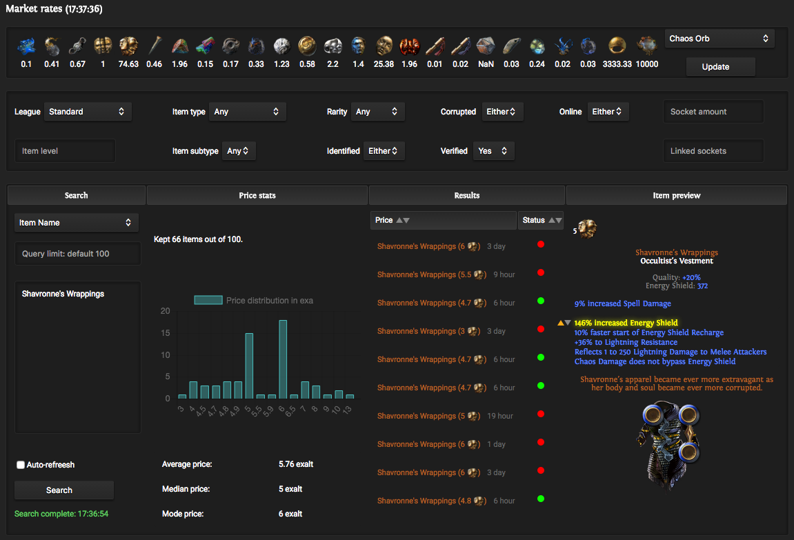

## Disclaimer

This indexer is for you if you have:
- A powerful spare computer with a lot of RAM, ideally 16GB to dedicate fully to the task
- At least 300 GB storage
- Unlimited bandwidth
- Knowledge in MySQL (Table optimization, index creation, db maintenance)

## What is included ?

This tool is composed of both an indexer for the official Path of Exile Stash API and a client interface.

## Indexer

#### Description
The indexer polls the official stash API at a given interval to retrieve JSON formatted stash contents. This content is then inserted into a Mongo database for future polling.

#### Installation
- Install NodeJS from https://nodejs.org/en/
- Install MySQL Server
    - Mac and Windows: Download from https://dev.mysql.com/downloads/installer
    - Linux (ubuntu): apt-get install mysql-server
- Import the schema.sql file
- Add a new user with rights to insert and update the POE DB
- Edit config.json to add credentials and ports

Required node packages can be installed through `npm install`.

#### How to run?
The indexer can be started with `node ./indexer-mysql.js` or `nodejs ./indexer-mysql.js` depending on your system.

##### CLI arguments
`-d` will output additional log informations into a _log.txt_ file. Only use to debug as it creates unnecessary IO traffic.

## Client

The client features:
- Market rates polling through [poe.trade](http://poe.trade)
    - last poll time
    - average value of that currency in the base currency
    - current min, max, median, mean and average values for that currency
    - Evolution of min and average values over the last day
    - Check the price of a base currency in function of others
    - Changing the league updates the currency values

- Price distribution
    - A plot to have a better idea of the current market price for a specific item
    - Average, median and mode prices

- Item search
    - Name autocomplete with different color codes: 
        - yellow for rare
        - orange for uniques
        - cyan for divination cards
        - green for gems
        - grey for currencies
        - magenta for prophecies
    - Mods also have auto-completion
    - Mods can be removed from the list by pressing the cross
    - By default a mod will have a value of # which matches any value. This can be edited to add any value.
    - A Mod value can be changed after being added by clicking on it in the list.
    - Search by type and subtype, affixes, last character name or account, amount of sockets/links, corruption, crafted or enchanted, moved/sold
    - Set query limit higher than 99 items
    - Auto-refresh the search at a fixed poll (10s) for now
    - Pop-up Notification when a search is complete

- Search result
    - Item entries have a color code:
        - red if corrupted
        - yellow if rare
        - orange if unique
        - blue if magic
        - white for normal
        - grey for currencies
    - Items can also have a lower opacity if sold/moved ( Available "no" or "either" )
    - All items have prices
    - Sort by explicit mod values, price or user activity
    - A time shows the last update registered for that item
    - By clicking on an item in the list, a message is copied into the clipboard to contact the owner. This message can be changed in the preferences.

- Search history
    - color coded in function of the type of item searched
    - click on an item to search for it again
    - click on the cross to remove it

- Preferences
    - Set default league
    - Set contact message

#### Installation
Required node packages can be installed through `npm install`. On Ubuntu it may also be required to create an alias of the nodejs command to node using the following `ln /usr/bin/nodejs /usr/bin/node`.

#### How to run?
The client can be started with `npm start`.

### Requirements
MySQL and NodeJS